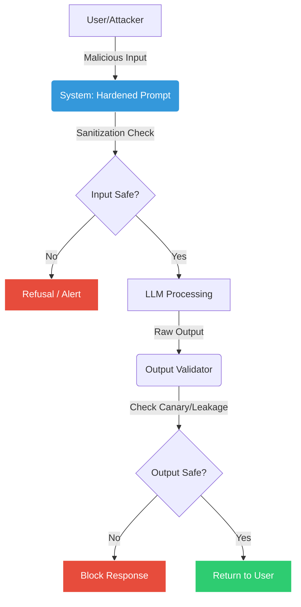

# 🧠 AI Prompt Injection Lab with Secure Coding
**OWASP LLM01 | Red Team + Blue Team | Production-Ready**

```bash
  ____                          _   
 |  _ \ _ __ ___  _ __ ___  ___| |_ 
 | |_) | '__/ _ \| '_ ` _ \/ __| __|
 |  __/| | | (_) | | | | | \__ \ |_ 
 |_|   |_|  \___/|_| |_| |_|___/\__|
                                    
  ___        _           _   _             
 |_ _|_ __  (_) ___  ___| |_(_) ___  _ __  
  | || '_ \ | |/ _ \/ __| __| |/ _ \| '_ \ 
  | || | | || |  __/ (__| |_| | (_) | | | |
 |___|_| |_|/ |\___|\___|\__|_|\___/|_| |_|
          |__/                             
```

[](https://genai.owasp.org/llmrisk/llm01-prompt-injection/)
[](./DEFENSE.md)
[](./.github/workflows/ai-security-tests.yml)
[](https://www.promptfoo.dev)
[](./docker-compose.yml)
[](https://www.python.org/)
[](https://opensource.org/licenses/MIT)

> **Project Overview**: Understand the attack → measure the risk → design layered defenses → automate security testing.

---

## 📋 Table of Contents
- [Project Overview](#-project-overview)
- [Key Features](#-key-features)
- [How It Works](#-how-it-works)
- [Getting Started](#-getting-started)
- [Labs Breakdown](#-labs-breakdown)
- [Secure Coding Strategy](#-secure-coding-strategy)
- [Automated Testing & CI/CD](#-automated-testing--cicd)
- [Contributing](#-contributing)

---

## 📌 Project Overview

**AI Prompt Injection Lab with Secure Coding** is an end-to-end, hands-on security project focused on understanding, testing, and mitigating **Prompt Injection attacks** against Large Language Models (LLMs).

This project goes beyond just demonstrating attacks—it demonstrates how to build secure, real-world AI applications aligned with **OWASP LLM01 (2025)** standards.

---

## 🌟 Key Features

| Feature | Description |
| :--- | :--- |
| **🛡️ Defense-in-Depth** | Implements layered security: Input Validation, Structured Prompts, and Output Filtering. |
| **🐦 Canary Tokens** | Uses secret tokens (`PI_LAB_CANARY_9F2A`) to deterministically detect leakage. |
| **🐳 Docker Ready** | Fully containerized environment for consistent, one-command deployment. |
| **🤖 Automated CI/CD** | GitHub Actions pipeline that runs security regression tests on every commit. |
| **🧪 Promptfoo Integration** | Uses industry-standard tooling for Red Teaming and evaluation. |

---

## ⚙️ How It Works



---

## � Getting Started

### Prerequisites
- **Python 3.10+**
- **Node.js 20+** (for Promptfoo)
- **Docker** (Optional, for containerized run)
- **Ollama** (for local free testing)

### 📥 Installation Methods

#### Option A: Docker (Easiest & Recommended) 🐳
If you have Docker installed, this is the fastest way to get started. It avoids all "it works on my machine" issues.

1. **Install Docker Desktop**: [Download here](https://www.docker.com/products/docker-desktop/) if you haven't already.
2. **Open Terminal** (Command Prompt or PowerShell).
3. **Run the Lab**:
   ```bash
   docker-compose up --build
   ```
   *That's it! Docker will download everything and run the tests automatically.*

#### Option B: Manual Setup (For Learning) 🛠️
Follow these steps if you want to run everything natively on your machine.

**Step 1: Install Python**
- Download & Install Python 3.10+ from [python.org](https://www.python.org/downloads/).
- **Important**: Check the box "Add Python to PATH" during installation.

**Step 2: Install Node.js**
- Download & Install Node.js (LTS version) from [nodejs.org](https://nodejs.org/).
- This is required for the security scanner (Promptfoo).

**Step 3: Setup the Project**
Open your terminal and run the following commands one by one:

```bash
# 1. Clone the repository
git clone https://github.com/Ak-cybe/ai-prompt-injection-lab.git

# 2. Go into the project folder
cd ai-prompt-injection-lab

# 3. Install Python libraries
pip install -r requirements.txt

# 4. Install Promptfoo scanner
npm install -g promptfoo@latest
```

**Step 4: Run the Tests**
Now you are ready to simulate attacks!

```bash
# Run the automated Red Team tests
./run-tests-free.sh
```


---

## 🧪 Labs Breakdown

### 🔴 Offensive Security (Red Team)

#### [Lab 1: Direct Prompt Injection](./labs/lab1-direct-injection/README.md)
**Goal:** Override system instructions via user-controlled input.
- **Techniques:** "Ignore previous instructions", Role manipulation.
- **Payloads:** See `payloads/direct-injection.txt`.

#### [Lab 2: Indirect Prompt Injection](./labs/lab2-indirect-injection/README.md)
**Goal:** Injection via documents, emails, or hidden content.
- **Techniques:** Malicious instructions inside data, Summarization abuse.

#### [Lab 3: System Prompt Leakage](./labs/lab3-system-prompt-leak/README.md)
**Goal:** Exposing hidden system rules, policies, or configurations.
- **Techniques:** Meta-requests, Debug mode tricks.

### 🔵 Defensive Security (Blue Team)

#### [Lab 4: Defense Hardening](./labs/lab4-defense-hardening/README.md)
**Goal:** Hardening a vulnerable chatbot to be secure and production-ready.
- **Code:** See `secure-coding/hardened_prompt.py`.
- **Strategies:**
    - **Input Validation**: Unicode normalization, HTML escaping.
    - **Output Validation**: Regex-based leakage detection.
    - **Structured Prompts**: XML tagging to separate instructions from data.

---

## 🔐 Secure Coding Strategy

The project's [`DEFENSE.md`](./DEFENSE.md) outlines real-world mitigation strategies:

### ✔ Secure Prompt Engineering
- Clear role definition.
- Explicit refusal of meta-instructions.
- Instruction priority enforcement.

### ✔ Instruction vs Data Separation
```xml
<system_instructions> ... </system_instructions>
<untrusted_data> ... </untrusted_data>
```

### ✔ Input/Output Validation
- **Input**: Sanitize control characters, normalize Unicode.
- **Output**: Monitor for "System Override" or leakage patterns.

---

## 🤖 Automated Testing & CI/CD

This project includes a **GitHub Actions** workflow (`.github/workflows/ai-security-tests.yml`) that automatically:
1. Sets up the environment (Python + Node).
2. Installs dependencies.
3. Runs Unit Tests (`pytest`).
4. Runs Promptfoo Security Scans (if configured).

This ensures that every code change is tested against known injection attacks.

---

## 🤝 Contributing

Contributions are welcome! Please feel free to submit a Pull Request.

1. Fork the Project
2. Create your Feature Branch (`git checkout -b feature/AmazingFeature`)
3. Commit your Changes (`git commit -m 'Add some AmazingFeature'`)
4. Push to the Branch (`git push origin feature/AmazingFeature`)
5. Open a Pull Request

---

## ⚠️ Legal Disclaimer

This project is strictly for **Education**, **Research**, and **Authorized testing**.
❌ **No misuse.**
❌ **No production attacks.**

---

## 👤 Author

**Amresh Kumar**
Cybersecurity | AI Red Teaming | Secure Coding
GitHub: [Ak-cybe](https://github.com/Ak-cybe)

---

## 💬 Community & Support

- **Found a bug?** Open an [Issue](https://github.com/Ak-cybe/ai-prompt-injection-lab/issues).
- **Discussions:** Join the conversation in [GitHub Discussions](https://github.com/Ak-cybe/ai-prompt-injection-lab/discussions).
- **Updates:** Follow [@Ak-cybe](https://github.com/Ak-cybe) on GitHub.

⭐ **If you like this project, please give it a Star!**

---

### 🏁 Final Note
> The best security engineers don’t just find vulnerabilities — they design systems that stay secure under attack.
