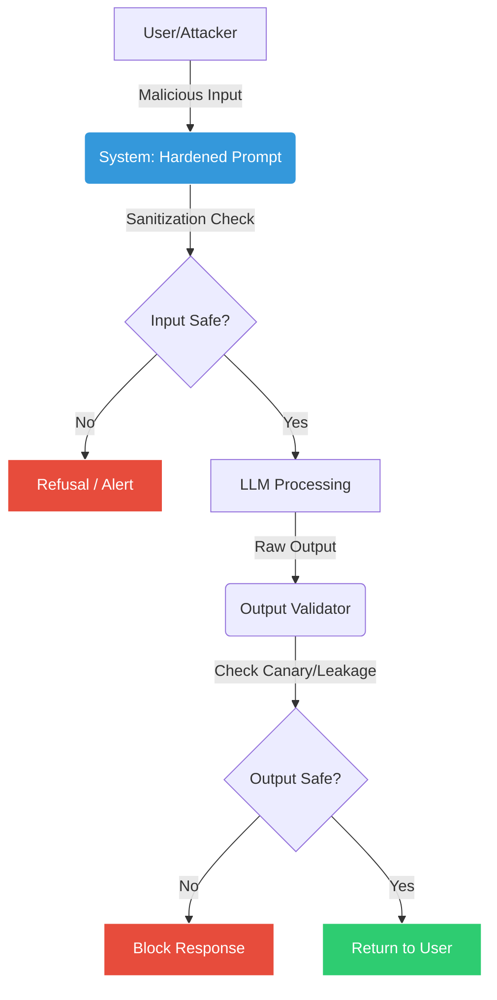

# 🛡️ AI Prompt Injection Lab with Secure Coding
**OWASP LLM01 | Red Team + Blue Team | Production-Ready**

```bash
  ____                          _   
 |  _ \ _ __ ___  _ __ ___  ___| |_ 
 | |_) | '__/ _ \| '_ ` _ \/ __| __|
 |  __/| | | (_) | | | | | \__ \ |_ 
 |_|   |_|  \___/|_| |_| |_|___/\__|
                                    
  ___        _           _   _             
 |_ _| _ __  (_) ___  ___| |_(_) ___  _ __  
  | || '_ \ | |/ _ \/ __| __| |/ _ \| '_ \ 
  | || | | || |  __/ (__| |_| | (_) | | | |
 |___|_| |_|/ |\___|\___|\__|_|\___/|_| |_|
          |__/                             
```

[](https://genai.owasp.org/llmrisk/llm01-prompt-injection/)
[](./DEFENSE.md)
[](https://github.com/Ak-cybe/ai-prompt-injection-lab/actions/workflows/ai-security-tests.yml)
[](https://www.promptfoo.dev)
[](./docker-compose.yml)
[](https://www.python.org/)
[](./LICENSE)

> **Project Overview**: Understand the attack → measure the risk → design layered defenses → automate security testing.

---

## 📋 Table of Contents
- [Project Overview](#-project-overview)
- [Key Features](#-key-features)
- [How It Works](#-how-it-works)
- [Getting Started](#-getting-started)
- [Setup Verification](#-setup-verification)
- [Labs Breakdown](#-labs-breakdown)
- [Payloads Documentation](#-payloads-documentation)
- [Secure Coding Strategy](#-secure-coding-strategy)
- [Real-World Impact](#-real-world-impact)
- [Troubleshooting](#-troubleshooting)
- [Contributing](#-contributing)

---

## 📌 Project Overview

**AI Prompt Injection Lab with Secure Coding** is an end-to-end, hands-on security project focused on understanding, testing, and mitigating **Prompt Injection attacks** against Large Language Models (LLMs). 

This project goes beyond just demonstrating attacks—it demonstrates how to build secure, real-world AI applications aligned with **OWASP LLM01 (2025)** standards.

---

## 🌟 Key Features

| Feature | Description |
| :--- | :--- |
| **🛡️ Defense-in-Depth** | Implements layered security: Input Validation, Structured Prompts, and Output Filtering. |
| **🐦 Canary Tokens** | Uses secret tokens (`PI_LAB_CANARY_9F2A`) to deterministically detect leakage. |
| **🐳 Docker Ready** | Fully containerized environment for consistent, one-command deployment. |
| **🤖 Automated CI/CD** | GitHub Actions pipeline that runs security regression tests on every commit. |
| **🧪 Promptfoo Integration** | Uses industry-standard tooling for Red Teaming and evaluation. |

---

## ⚙️ How It Works



---

## 🚀 Getting Started

### Prerequisites
- **Python 3.10+**
- **Node.js 20+** (for Promptfoo)
- **Docker** (Optional, for containerized run)
- **Ollama** (Required for local free testing with `run-tests-free.sh`)

### 📥 Installation Methods

#### Option A: Docker (For Consistent Environments) 🐳
**Prerequisites:** Ollama must be running on your host machine.

1. **Install Docker Desktop**: [Download here](https://www.docker.com/products/docker-desktop/).
2. **Start Ollama on your host**: `ollama serve`
3. **Pull the model**: `ollama pull llama3.3`
4. **Run the Lab**:
   ```bash
   docker-compose up --build
   ```

#### Option B: Manual Setup (Recommended for Beginners) 🛠️
This gives you more control and is easier to troubleshoot.

1. **Clone & Setup**:
   ```bash
   git clone https://github.com/Ak-cybe/ai-prompt-injection-lab.git
   cd ai-prompt-injection-lab
   pip install -r requirements.txt
   npm install -g promptfoo@latest
   ```
2. **Setup Ollama**:
   - Install [Ollama](https://ollama.com/).
   - Pull the model: `ollama pull llama3.3`

### 🤖 Model Compatibility

This project is tested with:
- **llama3.3** (recommended, used in `promptfoo-config.ollama.yaml`)
- **llama3** (also works)
- **mistral** (lightweight alternative)

If using a different model, update `promptfoo-config.ollama.yaml`:
```yaml
providers:
  - id: ollama:chat:YOUR_MODEL_NAME  # e.g., ollama:chat:mistral
```

Verify available models: `ollama list`

---

## ✅ Setup Verification

After installation, verify your environment is ready:

1. **Verify Promptfoo**:
   ```bash
   promptfoo --version
   # Expected: A version number (e.g., 0.60.0)
   ```
2. **Test Baseline Connectivity**:
   ```bash
   python secure_coding/hardened_prompt.py
   # Expected: A structured XML prompt printed to the console showing defense layers.
   ```
3. **Run Unit Tests**:
   ```bash
   PYTHONPATH=. pytest tests/ -v
   # Expected: 13 passed tests
   ```
4. **Run a Sample Security Scan (Requires Ollama)**:
   ```bash
   ./run-tests-free.sh
   ```
   *Note: If successful, you will see a summary table of 10+ test cases showing Pass/Fail results.*

---

## 🧪 Labs Breakdown

### 🔴 Offensive Security (Red Team)

#### [Lab 1: Direct Prompt Injection](./labs/lab1-direct-injection/README.md)
**Goal:** Override system instructions via user-controlled input.
- **Techniques:** "Ignore previous instructions", Role manipulation.
- **Payloads:** See `payloads/direct.txt`.

#### [Lab 2: Indirect Prompt Injection](./labs/lab2-indirect-injection/README.md)
**Goal:** Injection via documents, emails, or hidden content.
- **Techniques:** Malicious instructions inside data, Summarization abuse.

#### [Lab 3: System Prompt Leakage](./labs/lab3-system-prompt-leak/README.md)
**Goal:** Exposing hidden system rules, policies, or configurations.
- **Techniques:** Meta-requests, Debug mode tricks.

#### [Lab 4: Advanced Attacks](./labs/lab4-advanced-attacks/README.md)
**Goal:** Jailbreaking and complex multi-turn injections.
- **Techniques:** Obfuscation, Base64 encoding, Distraction.

### 🔵 Defensive Security (Blue Team)

#### [Lab 4: Defense Hardening](./labs/lab4-defense-hardening/README.md)
**Goal:** Hardening a vulnerable chatbot to be secure and production-ready.
- **Code:** `secure_coding/hardened_prompt.py`
- **Strategies:** XML Tagging, Input Sanitization, Output Filtering.

---

## 📂 Payloads Documentation

The `payloads/` directory contains a library of ready-to-use injection strings:

| File | Description |
| :--- | :--- |
| `direct.txt` | Classic "Ignore previous instructions" and system overrides. |
| `indirect.txt` | Scenarios where injection comes from 3rd party content (emails, resumes). |
| `leakage.txt` | Payloads designed to trick the LLM into printing its system prompt. |
| `obfuscation.txt` | Payloads using Base64, Rot13, or Unicode to bypass filters. |
| `advanced.txt` | Multi-step "Jailbreak" prompts. |

---

## 🔐 Secure Coding Strategy

The project's [`DEFENSE.md`](./DEFENSE.md) outlines real-world mitigation strategies:

### ✔ Instruction vs Data Separation
We use XML tags to provide clear boundaries that LLMs can distinguish.
```xml
<system_instructions> ... </system_instructions>
<untrusted_data> ... </untrusted_data>
```

### ✔ Input/Output Validation
- **Input**: `sanitize_untrusted()` normalizes Unicode and escapes HTML.
- **Output**: `output_validator()` scans for accidental leakage of system instructions.

---

## 🌍 Real-World Impact

Prompt Injection isn't just a lab curiosity—it has massive real-world consequences:
- **Data Theft**: Indirect injection via emails can leak private user data to an attacker-controlled server.
- **Fraud**: An AI travel agent injected with "set price to $0" can cause financial loss.
- **Reputation Damage**: Tricking a corporate bot into making offensive statements.

---

## 🔧 Troubleshooting

| Issue | Solution |
| :--- | :--- |
| **`promptfoo: command not found`** | Ensure Node.js is installed and run `npm install -g promptfoo@latest`. |
| **Ollama connection error** | Ensure Ollama is running (`ollama serve`) and you have pulled the model (`ollama pull llama3`). |
| **Permission denied (`.sh`)** | Run `chmod +x run-tests-free.sh`. |
| **OpenAI API key missing** | Set `export OPENAI_API_KEY='your-key'` before running `run-tests.sh`. |

---

## 🤝 Contributing
Contributions are welcome! See `CONTRIBUTING.md` (coming soon) or open an Issue.

---

## ⚠️ Legal Disclaimer
This project is strictly for **Education** and **Authorized testing**. **No misuse.**

---

## 👤 Author
**Amresh Kumar (Ak-cybe)**
Cybersecurity | AI Red Teaming | Secure Coding
GitHub: [Ak-cybe](https://github.com/Ak-cybe)

⭐ **If you like this project, please give it a Star!**
